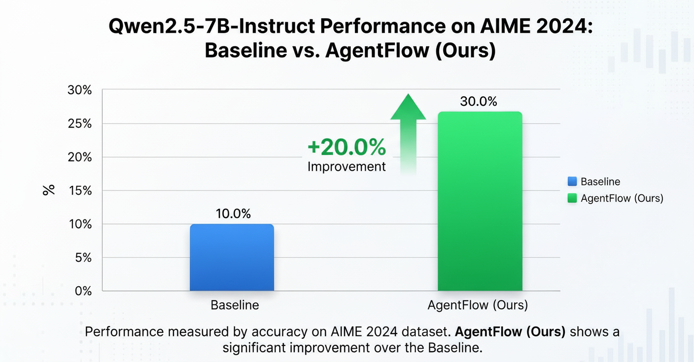
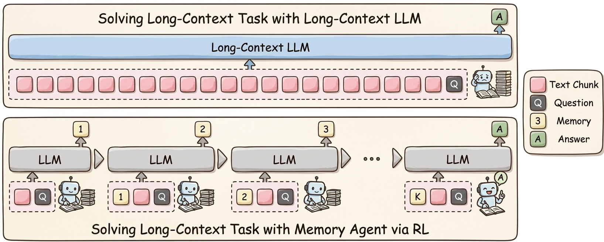
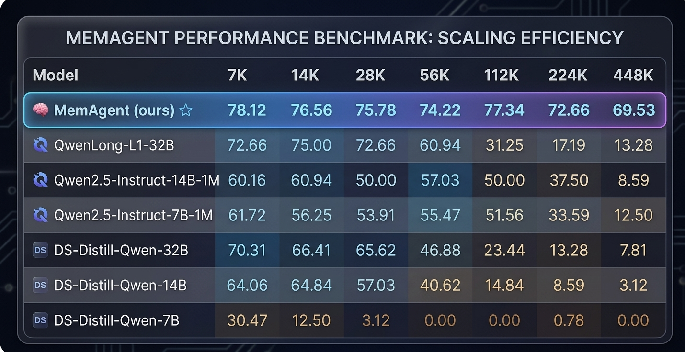
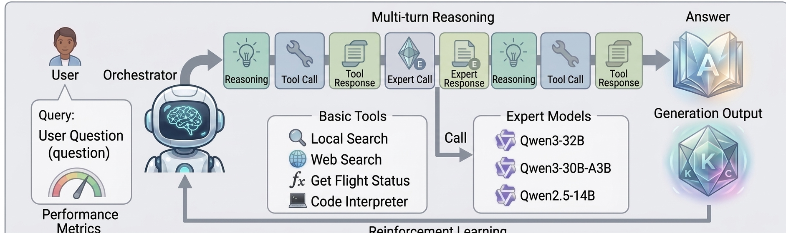
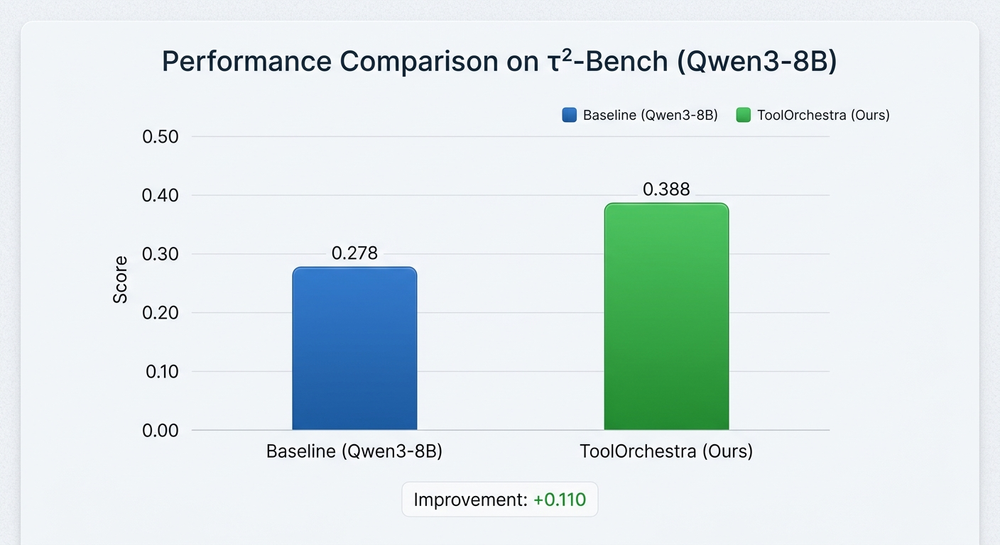

# Agentic RL Reproductions with Slime


Reproductions of various **Agentic RL** training methods, built on top of the [slime](https://github.com/THUDM/slime) framework.

slime exposes flexible hooks for custom `generate` functions and reward functions, making it straightforward to integrate multi-step agent rollouts into RL training pipelines. This repository implements and reproduces representative Agentic RL algorithms on top of that foundation. All implementations live under the [`agentic/`](./agentic) directory.

[中文文档](./README_zh.md)

---

## Implemented Methods

### AgentFlow — `agentic/agentflow/`

Reproduces the core idea of [AgentFlow](https://arxiv.org/abs/2510.05592): extending single-step LLM inference into a multi-turn **Planner → Executor → Verifier** agent loop, applying RL signals (GRPO) to the Planner's generation trajectory. This allows the model to improve its tool-use and reasoning capabilities without requiring manually annotated intermediate steps.

#### Architecture


```
Input question
  │
  ▼
Planner.plan()              ← Analyze the problem and devise a solution strategy (loss_mask=1)
  │
  └─► for step in range(max_steps):
        │
        ├─ Planner.generate_next_step()             ← Select next tool and sub-goal (loss_mask=1)
        ├─ Executor.generate_tool_command()
        │  + execute_command()                       ← Invoke tool (excluded from sequence)
        ├─ Verifier.verificate_context()             ← Decide whether to continue (excluded)
        └─ Memory.add_action()                       ← Record execution result
  │
  ▼
Planner.generate_final_output()   ← Summarize results and produce final answer (loss_mask=0)
  │
  ▼
Rewarder.compute_reward()         ← LLM-as-Judge: compare model answer with ground truth
```

#### Tools (`tools/`)

| Tool | Description |
|---|---|
| `base_generator` | General-purpose text generation tool; answers sub-tasks directly via LLM |
| `python_coder` | Python code generation and execution tool for math computation and algorithmic problem solving |

#### Results




| Model | Dataset | Baseline | AgentFlow (Ours) | Improvement |
|---|---|---|---|---|
| Qwen2.5-7B-Instruct | AIME 2024 | 10.0% | 30.0% | +20.0% |


The trained model weights have been released on HuggingFace: [LMIS-ORG/AgentFlow_Slime_Agentic_Qwen2.5_7B](https://huggingface.co/LMIS-ORG/AgentFlow_Slime_Agentic_Qwen2.5_7B/tree/main)


#### Training Configuration

- **Algorithm**: GRPO with KL divergence constraint (`low_var_kl`)
- **Model**: Qwen2.5-7B (replaceable)
- **Dataset**: DAPO-Math-17K
- **Inference Engine**: SGLang (Planner and Executor run on separate ports)
- **Evaluation**: AIME 2024

#### Quick Start

All training parameters and launch instructions can be found in [`agentic/agentflow/`](./agentic/agentflow).


---

### MemAgent — `agentic/memagent/`

Reproduces the core idea of [MemAgent](https://arxiv.org/abs/2507.02259): compressing arbitrarily long documents into a fixed-size **recurrent memory** via a chunk-by-chunk LLM update loop, then answering questions from memory alone. RL (GRPO) is applied to all memory-update turns using a **Multi-Conversation** training objective, so the model learns to retain what matters across chunks without ever seeing the full context at once.

#### Architecture


```
Input: question + long document
  │
  ▼
memory = "No previous memory"
  │
  └─► for chunk in split(document, chunk_tokens):
        │
        └─ LLM(problem, memory, chunk) → updated memory   (loss_mask=1)
  │
  ▼
LLM(problem, memory) → final answer in \boxed{}           (loss_mask=0)
  │
  ▼
Reward: exact-match / F1 against ground truth
         (distributed evenly across all memory-update turns)
```

Each memory-update turn is an independent training sequence. The reward is evenly amortised across all turns in the conversation (via `custom_convert`), matching the Multi-Conv RL objective in the MemAgent paper.

#### Results

Evaluated on **RULER-HQA** across context lengths from 7K to 448K tokens (5 runs, best score reported):


MemAgent (ours) is trained on a **7B** base model and consistently outperforms all baselines, including much larger models, across all context lengths.
The trained model weights have been released on HuggingFace: [LMIS-ORG/MemAgent_Slime_Agentic_Qwen2.5_7B](https://huggingface.co/LMIS-ORG/MemAgent_Slime_Agentic_Qwen2.5_7B)

#### Training Configuration

- **Algorithm**: GRPO with KL divergence constraint (`low_var_kl`)
- **Model**: Qwen2.5-7B (replaceable)
- **Dataset**: HotpotQA ([BytedTsinghua-SIA/hotpotqa](https://huggingface.co/datasets/BytedTsinghua-SIA/hotpotqa))
- **Inference Engine**: SGLang with YaRN (`--sglang-context-length 131072`)
- **Evaluation**: RULER-HQA (7K → 448K)

#### Quick Start

All training parameters and launch instructions can be found in [`agentic/memagent/`](./agentic/memagent).

---

### ToolOrchestra — `agentic/ToolOrchestra/`

Reproduces the core idea of [ToolOrchestra](https://arxiv.org/abs/2511.21689): an **Orchestrator-Expert** multi-agent framework for RL training. A central Orchestrator LLM learns to route tasks to the best specialized expert model and the corresponding tools through multi-turn tool calls. GRPO is applied to the Orchestrator's decision trajectory, enabling it to improve tool-use and routing capabilities without manually annotated intermediate steps.

#### Architecture


```
Input question
  │
  ▼
Orchestrator LLM                        ← Decide which tool to call (loss_mask=1)
  │
  └─► for turn in range(max_turns):
        │
        ├─ parse_tool_call()            ← Parse <tool_call> from model output
        │
        ├─ tool call                    ← Call retrieval / external tool (loss_mask=0)
        │    └─ FAISS retrieval service (port 8000)
        │
        ├─ call_expert ──────────────► Expert LLM routing (loss_mask=0)
        │                               └─ specialist models on separate ports
        │
        └─ answer ──────────────────► Final answer → stop loop
  │
  ▼
GenerationOutput
  - token_ids + log_probs  (all turns concatenated)
  - loss_mask: Orchestrator output = 1 / tool result = 0
```

#### Results


| Model | Dataset | Baseline (Qwen3-8B) | ToolOrchestra (Ours) | Improvement |
|---|---|---|---|---|
| Qwen3-8B | τ²-Bench | 0.278 | 0.388 | +0.110 |

The trained model weights have been released on HuggingFace: [LMIS-ORG/ToolOrchestra_Slime_Agentic_Qwen3_8B](https://huggingface.co/LMIS-ORG/ToolOrchestra_Slime_Agentic_Qwen3_8B)

#### Training Configuration

- **Algorithm**: GRPO with KL divergence constraint (`low_var_kl`)
- **Model**: Qwen3-8B (replaceable)
- **Dataset**: τ²-Bench
- **Inference Engine**: SGLang (expert models run on separate ports)
- **Evaluation**: τ²-Bench

#### Quick Start

All training parameters and launch instructions can be found in [`agentic/ToolOrchestra/`](./agentic/ToolOrchestra).

---

## How It Integrates with Slime

Each method hooks into the training loop via three slime customization points:

```bash
--custom-generate-function-path             rollout.generate    # custom multi-step rollout
--custom-rm-path                            rollout.reward_func # custom reward computation
--custom-eval-rollout-log-function-path     rollout.eval_log    # custom eval logging
```

The `generate` function constructs the full agent trajectory and returns a token sequence with a `loss_mask`. Only tokens generated by the Planner participate in gradient computation; injected tool results and the final summary output have their masks set to 0.

---

## Requirements

The recommended way to set up the environment is via the official Docker image:

```bash
# Pull the latest image
docker pull slimerl/slime:latest

# Start the container
docker run --rm --gpus all --ipc=host --shm-size=16g \
  --ulimit memlock=-1 --ulimit stack=67108864 \
  -it slimerl/slime:latest /bin/bash
```

For manual installation, see [`requirements.txt`](./requirements.txt) and [`docker/`](./docker).

Key dependencies:

- `slime >= 0.2.2`
- `sglang`
- `ray`
- `transformers`
- `torch >= 2.0`

---

## Roadmap


PRs and issues are welcome for discussions on integrating new methods.
